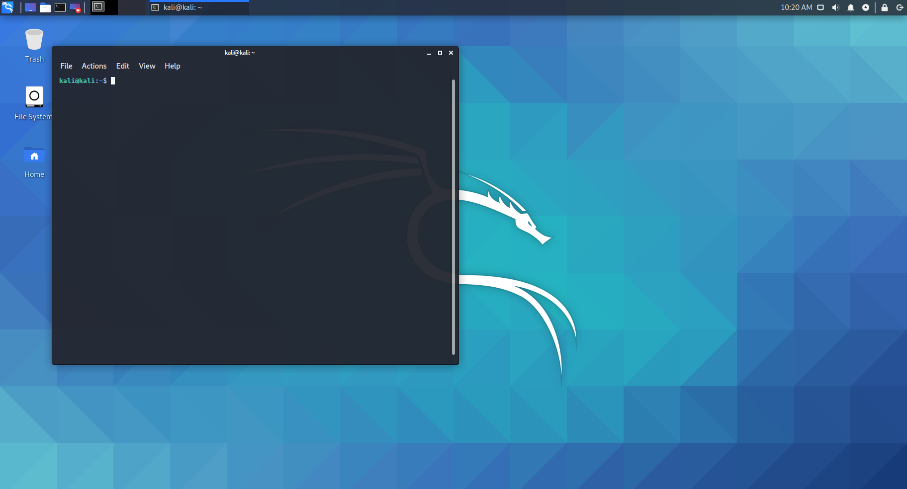

# embedded-pentesting
Penetration testing on a Raspberry Pi is a fun way to explore the world of security within a limited computing environment. This guide will go through the steps of setting up Kali Linux on a Raspberry Pi and preparing the environment to run Kismet.

You will need:
* Raspberry Pi (later version recommended for performance) - I tested this on a Raspberry Pi 3 Model B and a Raspberry Pi 4 Model B (4GB)
* Wireless networking card that supports monitor mode - I used a Panda Wireless PAU06 (300 Mbps)
* Compatible Kali Linux ARM image - I used the 64-bit version from Offensive Security's [Downloads page](https://www.offensive-security.com/kali-linux-arm-images/).
* Micro SD card - I used a 16GB card

## Kali Linux
Kali Linux is a Debian-based Linux distribution from [Offensive Security](https://www.kali.org/docs/introduction/what-is-kali-linux/), successor to the Backtrack Linux system. Kali Linux comes with an environment pre-configured for security, with features such as disabled networking by default. It alsoc comes equipped with dozens of security testing tools, such as SQL map, Metasploit, Aircrack-ng, and Kismet. To set up Kali Linux on a Raspberry Pi:

1. Download the 64-bit image from Offensive Security

2. Download etcher (installaton not necessary)

3. Etch image onto SD card. Note that the Linux dd command will not work here and will lead to kernel errors upon startup.

4. Boot up the Raspberry Pi:



5. Your username and password are 'kali' by default. Change the password with 'passwd'

6. Change your default ssh keys:
```
$ sudo rm /etc/ssh/ssh_host_*
$ sudo dpkg-reconfigure openssh-server
$ sudo service ssh restart
```
7. Now is not a bad time to back up your configured Raspberry Pi image on your Linux machine just in case:
```
$ sudo dd bs=4M if=/dev/sdb of=rpi-4B-kali-4.19-backup.img
```
## Kismet
Kismet is a WLAN analyser, sniffer, and intrusion detection system, compatible with the majority of 802.11 networks. We must do a few things before we can successfully run it, however.

1. Run "ip a" to get a listing of networked devices:
```
kali@kali:~$ ip a
1: lo: <LOOPBACK,UP,LOWER_UP> mtu 65536 qdisc noqueue state UNKNOWN group default qlen 1000
    link/loopback 00:00:00:00:00:00 brd 00:00:00:00:00:00
    inet 127.0.0.1/8 scope host lo
       valid_lft forever preferred_lft forever
    inet6 ::1/128 scope host 
       valid_lft forever preferred_lft forever
2: eth0: <NO-CARRIER,BROADCAST,MULTICAST,UP> mtu 1500 qdisc mq state DOWN group default qlen 1000
    link/ether dc:a6:32:0e:6a:ce brd ff:ff:ff:ff:ff:ff
3: wlan0: <NO-CARRIER,BROADCAST,MULTICAST,UP> mtu 1500 qdisc pfifo_fast state DOWN group default qlen 1000
    link/ether aa:13:ea:c3:46:8b brd ff:ff:ff:ff:ff:ff
```
2. Plug in your wirelss card, then run "ip a" again to identify the new device. It will likely show up as wlan1:
```
kali@kali:~$ ip a
1: lo: <LOOPBACK,UP,LOWER_UP> mtu 65536 qdisc noqueue state UNKNOWN group default qlen 1000
    link/loopback 00:00:00:00:00:00 brd 00:00:00:00:00:00
    inet 127.0.0.1/8 scope host lo
       valid_lft forever preferred_lft forever
    inet6 ::1/128 scope host 
       valid_lft forever preferred_lft forever
2: eth0: <NO-CARRIER,BROADCAST,MULTICAST,UP> mtu 1500 qdisc mq state DOWN group default qlen 1000
    link/ether dc:a6:32:0e:6a:ce brd ff:ff:ff:ff:ff:ff
3: wlan0: <NO-CARRIER,BROADCAST,MULTICAST,UP> mtu 1500 qdisc pfifo_fast state DOWN group default qlen 1000
    link/ether 32:9b:d9:bb:32:79 brd ff:ff:ff:ff:ff:ff
**4: wlan1: <NO-CARRIER,BROADCAST,MULTICAST,UP> mtu 1500 qdisc mq state DOWN group default qlen 1000
    link/ether 82:b7:cc:09:e4:7d brd ff:ff:ff:ff:ff:ff**
```
3. Put the card in monitor mode by running "airmon-ng start":
```
kali@kali:~$ sudo airmon-ng start wlan1
```
4. Observe the new interface "wlan1mon"
```
kali@kali:~$ ip a
1: lo: <LOOPBACK,UP,LOWER_UP> mtu 65536 qdisc noqueue state UNKNOWN group default qlen 1000
    link/loopback 00:00:00:00:00:00 brd 00:00:00:00:00:00
    inet 127.0.0.1/8 scope host lo
       valid_lft forever preferred_lft forever
    inet6 ::1/128 scope host 
       valid_lft forever preferred_lft forever
2: eth0: <NO-CARRIER,BROADCAST,MULTICAST,UP> mtu 1500 qdisc mq state DOWN group default qlen 1000
    link/ether dc:a6:32:0e:6a:ce brd ff:ff:ff:ff:ff:ff
3: wlan0: <NO-CARRIER,BROADCAST,MULTICAST,UP> mtu 1500 qdisc pfifo_fast state DOWN group default qlen 1000
    link/ether 1a:98:21:48:29:a7 brd ff:ff:ff:ff:ff:ff
4: wlan1: <BROADCAST,MULTICAST> mtu 1500 qdisc mq state DOWN group default qlen 1000
    link/ether 86:04:c1:4b:b5:5d brd ff:ff:ff:ff:ff:ff
**5: wlan1mon: <BROADCAST,MULTICAST,PROMISC,UP,LOWER_UP> mtu 1500 qdisc mq state UNKNOWN group default qlen 1000
    link/ieee802.11/radiotap 9c:ef:d5:fc:1f:7d brd ff:ff:ff:ff:ff:ff**
```
5. Before starting Kismet, add your username (kali) to the kismet group and log in again:
```
kali@kali:~$ sudo usermod -a -G kismet kali

kali@kali:~$ su kali

kali@kali:~$ groups
ali : kali dialout cdrom sudo audio dip video plugdev netdev bluetooth lpadmin scanner kismet
```
6. We are ready to begin using Kismet on our new interface!
```
kali@kali:~$ kismet -c wlan1mon
```
